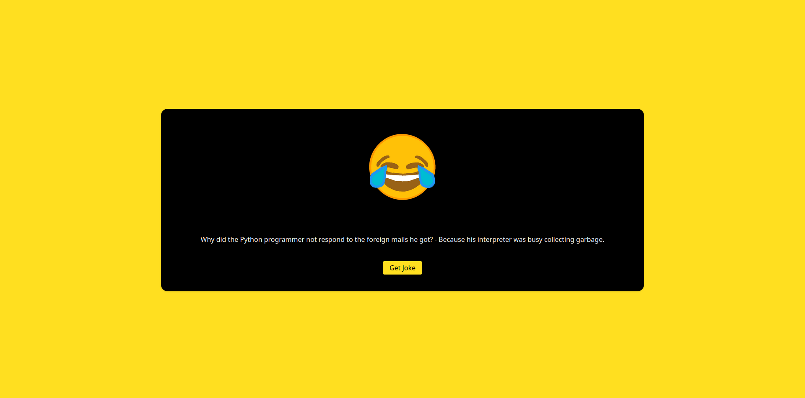

# Random Joke Generator

A simple React app that fetches random jokes using the [JokeAPI](https://v2.jokeapi.dev/).

## Features
- Fetches random jokes from the JokeAPI
- Mobile-friendly, responsive design
- Uses TailwindCSS for styling

## Installation

1. Clone the repository:
   ```sh
   git clone https://github.com/your-username/random-joke-generator.git
   ```
2. Navigate into the project directory:
   ```sh
   cd random-joke-generator
   ```
3. Install dependencies:
   ```sh
   npm install
   ```
4. Start the development server:
   ```sh
   npm start
   ```

## Usage
- Click the **"Get Joke"** button to fetch and display a random joke.
- Jokes are retrieved from the [JokeAPI](https://jokeapi.dev/).

## Technologies Used
- React
- TailwindCSS
- JokeAPI

## Screenshot

## License
This project is open-source under the [MIT License](LICENSE).

